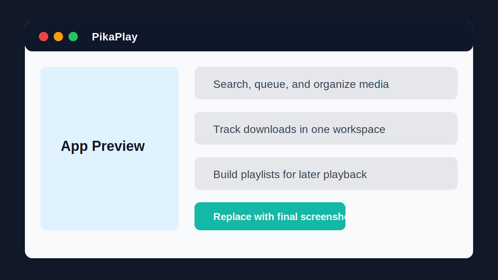
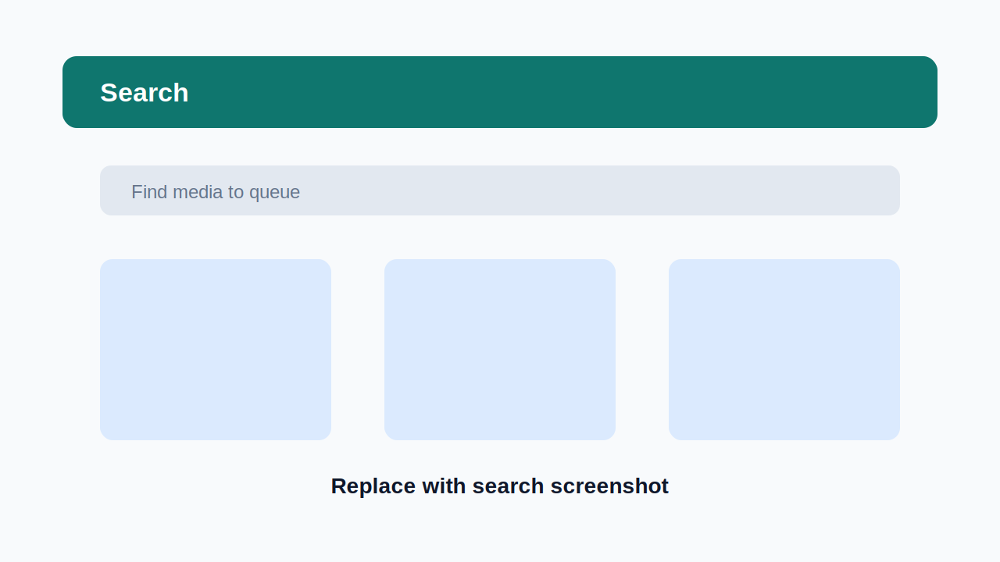
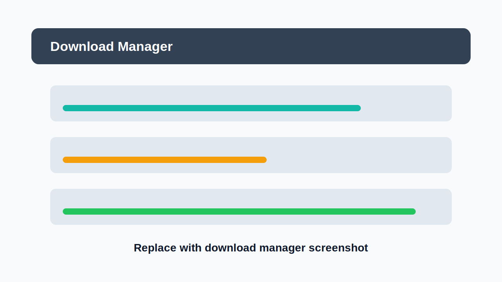
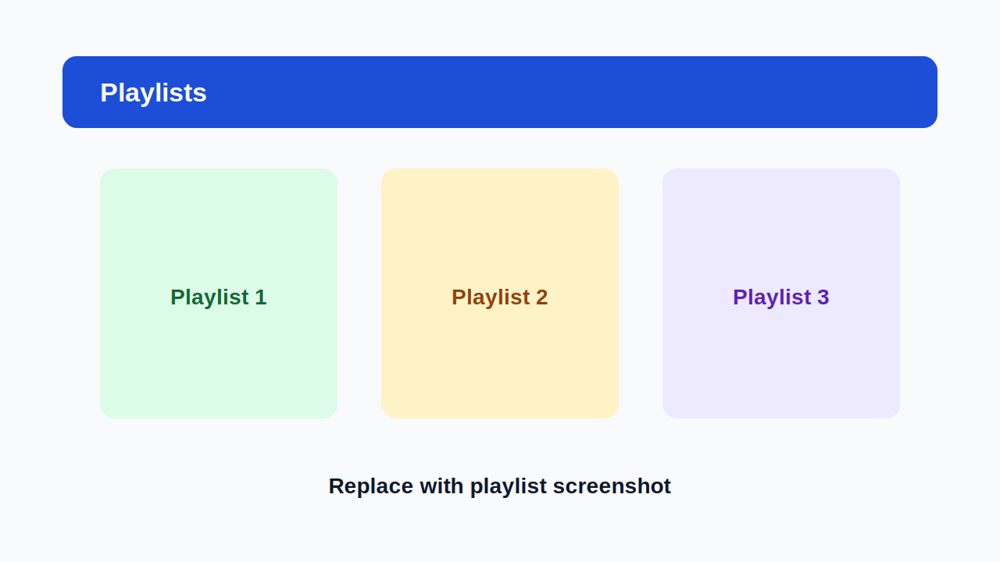

# PikaPlay

PikaPlay is a desktop app for saving, organizing, and managing media playlists in one focused workspace.

## Alpha Download

PikaPlay is currently in alpha. Builds may change quickly while the desktop experience is being tested.

### Windows

1. Open the [latest alpha release](https://github.com/EoCiMrEo/PikaPlay/releases/latest).
2. Download the Windows installer from the release assets.
3. Run the installer.
4. Launch PikaPlay from the Start Menu or desktop shortcut.

## Demo

## Screenshots

## Highlights

- Search and queue media from a desktop-first interface.
- Track download jobs and progress in one place.
- Build and manage playlists for later playback.
- Use a packaged Windows alpha build without setting up the development environment.

## Alpha Status

This repository is the public release home for PikaPlay. Development happens separately, while this repo stays focused on releases, install instructions, screenshots, and demo media.

## Feedback

Found a bug or have an idea for the alpha? Open an issue in this repository.
